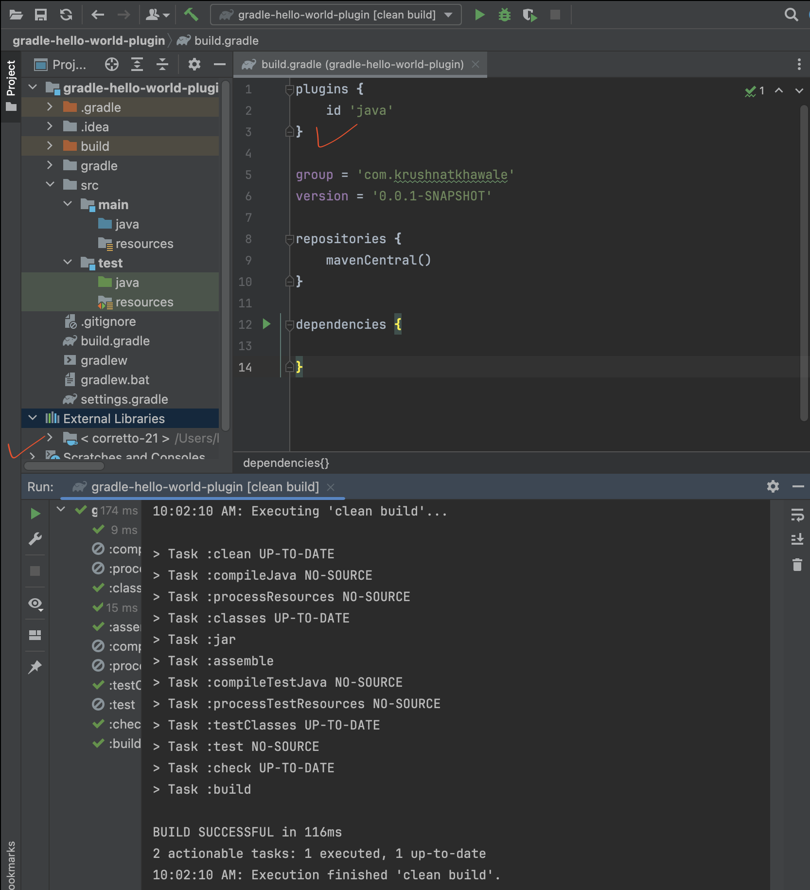
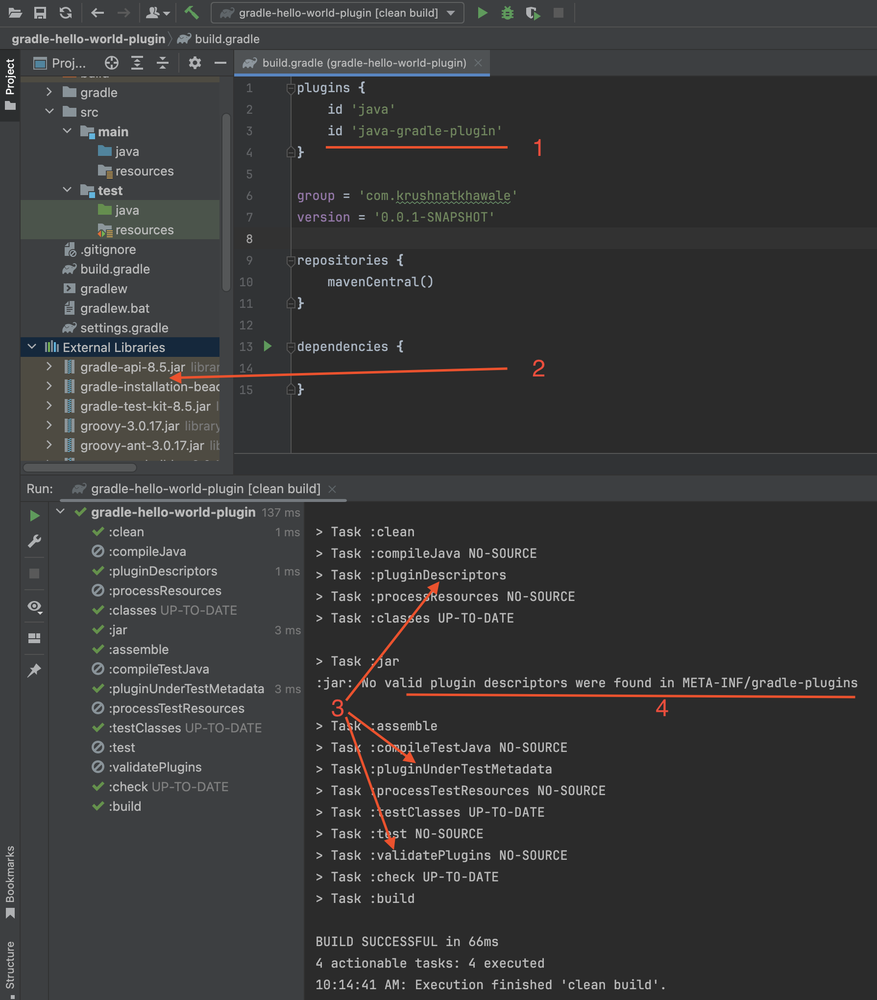
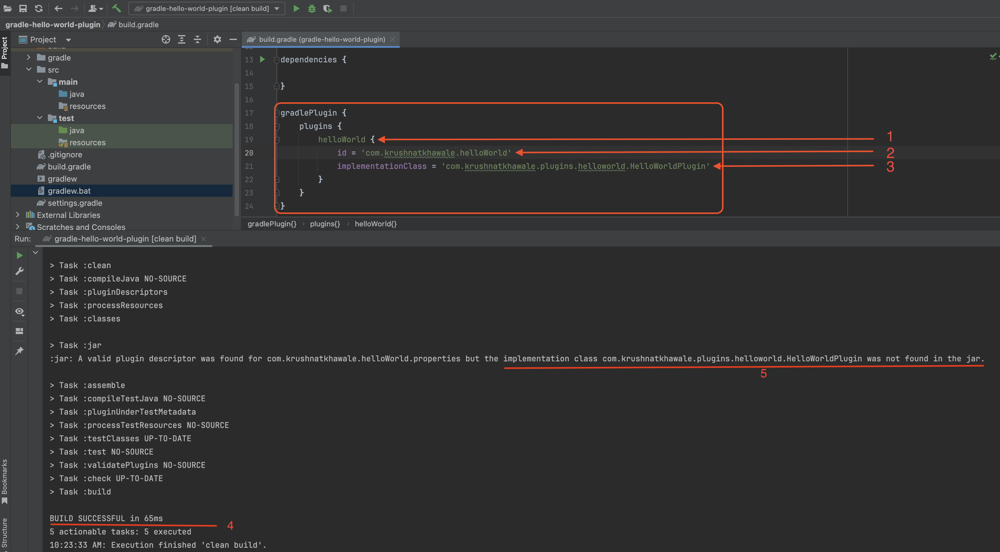
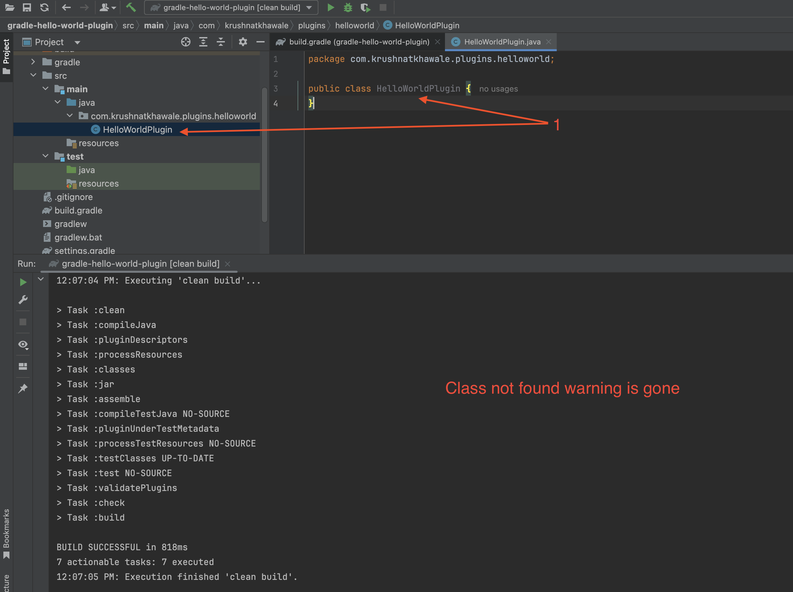
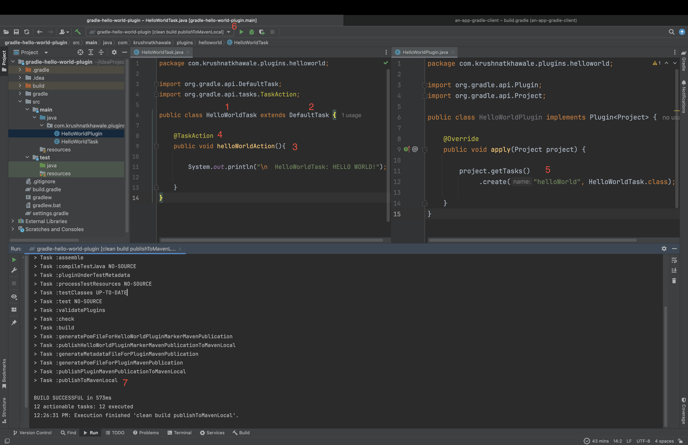
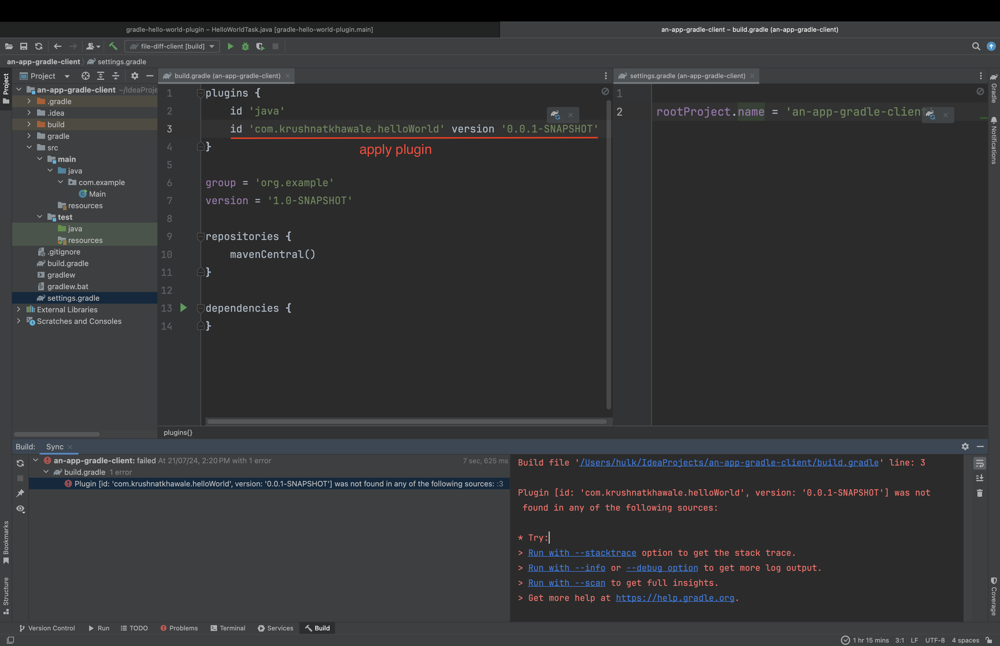
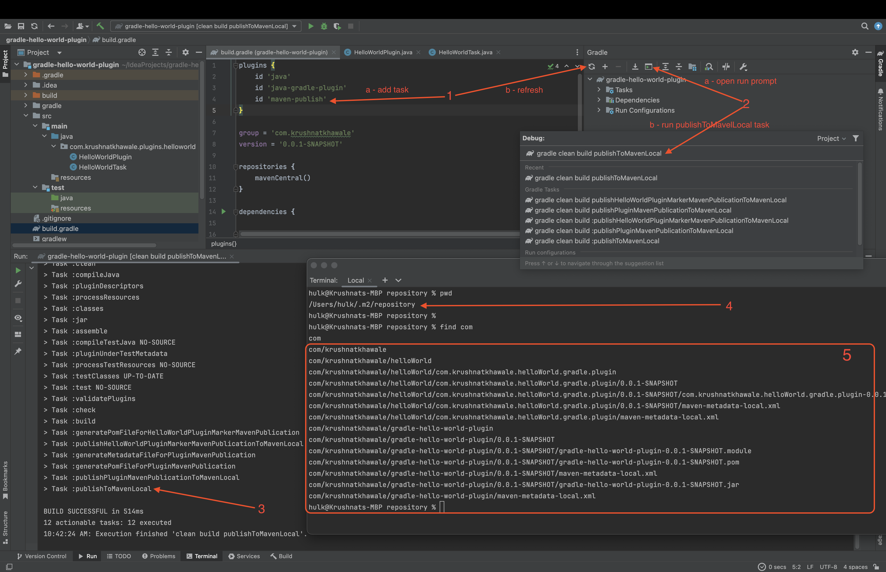
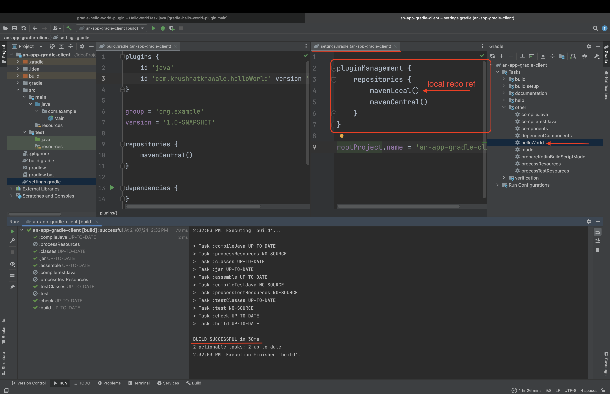
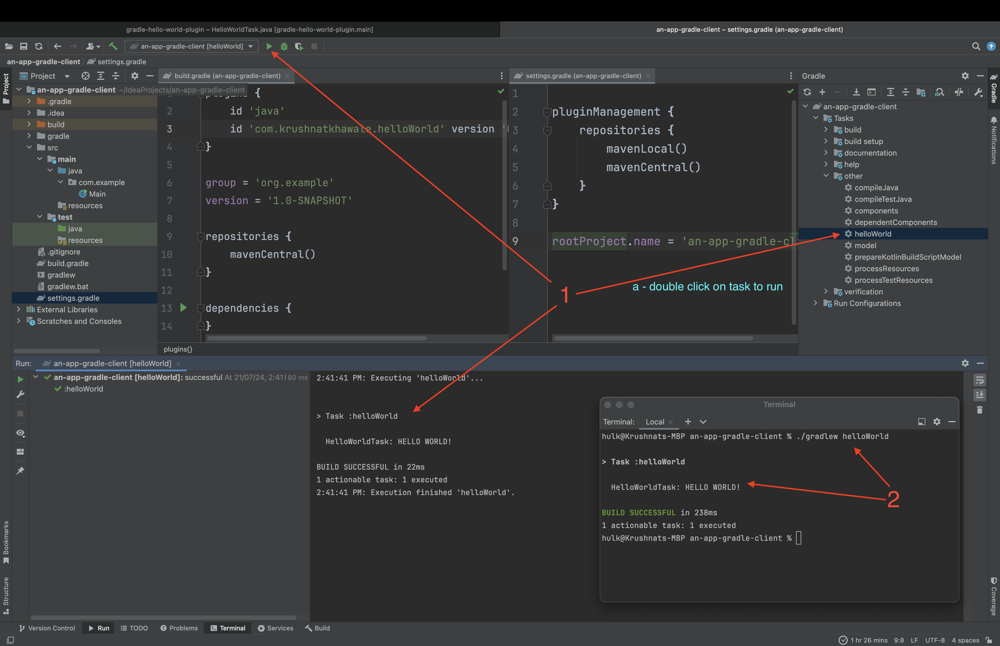

# Hello World Gradle Plugin ( Java )

This is a very basic example of creating a custom gradle plugin using Java.

Let's get started with creating a gradle plugin.

### 1. Create a java-gradle application



As you can see, above is an empty java gradle project. Two things to notice here,

1. there is only java plugin applied (so far)
2. there is only java as a library under 'External Libraries' (In project window on the left), so far


### 2. Configure the project as gradle plugin
 
The project can be configured as gradle plugin by using the plugin `java-gradle-plugin` under plugins section in `build.gradle` file as follows
```groovy
plugins {
    id 'java-gradle-plugin'
}
```


The screenshot above highlights things to notice such as,

1. `java-gradle-plugin` is applied ( line number 3 in build.gradle )
2. As soon as project is refreshed, the **External Libraries** will contain required gradle-api and gradle kit for plugin development
3. When Gradle's `clean build` tasks are run, notice gradle plugin related tasks appeared and got run (highlighted in logs) 
4. Now that plugin tasks are added and run, observe point 4 where a warning is logged about there is no plugin descriptor found


### 3. Add a plugin descriptor

A plugin descriptor, describes the name of the plugin and the class implementing the plugin.
There are two ways to add a plugin descriptor (a) a properties file at **META-INF/gradle-plugins** in the resources directory (b) using Gradles `gradlePlugin` descriptor in build.gradle
This example is using `gradlePlugin` to describe the plugin.









